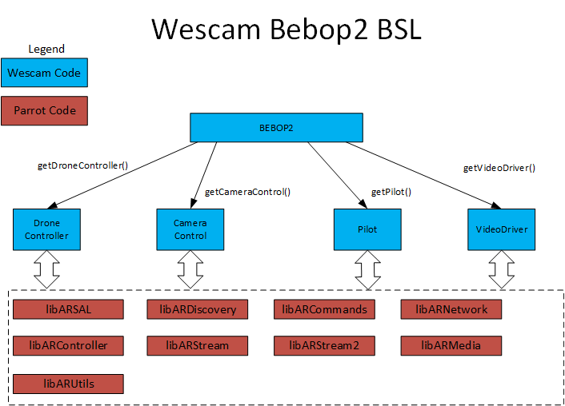

1) clone this library
2) make
3) source setupEnv.sh

To control one drone:
./bebop2Swarm alpha

To control two drones
./bebop2Swarm alpha bravo

To control three drones
./bebop2Swarm alpha bravo charlie

